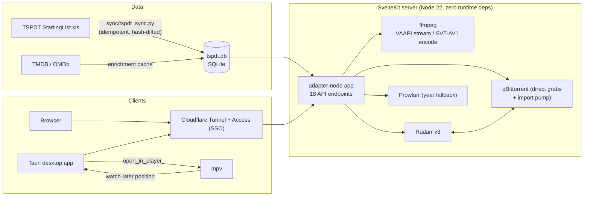

# Film Index

A self-hosted catalogue, tracker, and player for TSPDT's ranked film canon — the full **~26,500-film Starting List**, headlined by the **1,000 Greatest Films**. Browse the ranking, keep a per-user watchlist, fetch films into your media library with one click, and watch them in the browser or in mpv.

[](https://github.com/chrisJuresh/films/actions/workflows/deploy.yml)
[](https://github.com/chrisJuresh/films/actions/workflows/desktop.yml)
[](https://github.com/chrisJuresh/films/releases/latest)

["They Shoot Pictures, Don't They?"](https://theyshootpictures.com) aggregates thousands of critics' polls into an annual ranking of the greatest films ever made. Working through that list is a years-long project, and no single streaming service has more than a fraction of it. Film Index turns the list into a private cinema: a SvelteKit web app over a SQLite database synced from the official spreadsheet, wired into a Radarr/Prowlarr/qBittorrent home-server stack for acquisition and an ffmpeg/Intel-iGPU pipeline for playback, plus a Tauri desktop app for native mpv viewing.

It runs on my home server at **films.chrisj.uk**, behind a Cloudflare Tunnel with Cloudflare Access SSO, so the instance itself is private — but everything here is reproducible from this repo.

<!-- screenshot: catalogue grid (dark theme) with posters, rank badges, and the sidebar facets/age slider -->

## Features

**Catalogue & tracking**

- The full TSPDT Starting List (~26,500 films) with per-edition rank history (sparkline per film), synced idempotently from the official `.xls` — new editions need no schema change.
- Faceted browsing: full-text search, decade, genre, country, colour, "new this edition", and download state, with infinite scroll and persistent filters.
- Per-user watchlist / seen / rewatch / unfinished, keyed on your Cloudflare Access identity — no accounts to build, nothing to log into twice.
- Letterboxd import: upload your `watched.csv` (or the whole export `.zip` — parsed with a hand-written, zero-dependency ZIP reader), tracked separately from site state, with a reconciliation page for mismatches.
- TMDB + OMDb enrichment (posters, cast, trailers, IMDb/RT/Metacritic ratings) cached in SQLite and served from a local poster cache. Without API keys the app still works, with typographic posters.
- An age-rating slider that maps dozens of national certification systems (MPAA, BBFC, HK Cat I–III, Korean, Israeli, Thai…) onto one "minimum age" axis — most-restrictive-wins, so nothing unsuitable slips into a younger bracket.

**Acquisition (home-server integrations)**

- One-click Download via Radarr, with two honest fallbacks for the hard cases:
  1. **Prowlarr year-fallback** — Radarr searches on TMDB's year, which it won't let you override, so films whose festival year differs find nothing; the app re-searches Prowlarr on the catalogue year and pushes the pick back through Radarr so it still imports and renames.
  2. **qBittorrent-direct** — some classic titles defeat Radarr's release parser entirely (*"Jeanne Dielman, 23, quai du Commerce, 1080 Bruxelles"* — the 1080 reads as a resolution). Those are added straight to qBittorrent with validated `.torrent` bytes, then force-imported into Radarr by movie id when complete.
- Interactive release picker (quality/seeders/size, rejection reasons shown, Radarr's auto-pick marked) and a live download tracker with per-poster progress bars.
- Failures are reported truthfully: "indexer temporarily down (retry ~14:30)" rather than a silent spinner.

**Playback**

- **In the browser**: plays the file directly when the codec allows, streams an on-the-fly Intel iGPU (VAAPI) transcode when it doesn't, or builds a one-time seekable SVT-AV1 10-bit copy (HDR sources tone-mapped to SDR) with live encode progress.
- **In mpv** via the desktop app: streams the untouched original (no lossy re-encode), authenticates through Cloudflare Access automatically, resumes where you left off, and reports the position back so your watched-% stays in sync.
- **Offline**: "Save to PC" downloads the source file to any folder with resume-after-disconnect (HTTP Range), retry, and app-wide progress.
- Playback position is stored per user across all three modes.

## Architecture



Three deliberate design choices shape the codebase:

1. **Zero runtime npm dependencies.** The server uses Node 22's built-in `node:sqlite`, `fetch`, and streams; the Letterboxd ZIP/CSV parsers are hand-written. `package.json` has only dev-dependencies, so the built output is fully self-contained.
2. **SQLite as the single source of truth.** The Python sync is set-based and transactional (insert / update / reactivate / soft-delete, detected via per-film content hashes), and the ranking page is served by a partial covering index — an index-only scan the sync report proves with `EXPLAIN QUERY PLAN`.
3. **Identity from the edge.** Cloudflare Access authenticates every request and injects the user's email as a header; the app trusts it only because the container's port is never published to the LAN (see [`deploy/README.md`](deploy/README.md) for the threat model).

## Project structure

```
sync/       Python pipeline: TSPDT .xls → SQLite (+ age-rating backfill)
src/        SvelteKit app
  lib/server/   db, Radarr/Prowlarr/qBittorrent clients, transcoding, metadata
  routes/       catalogue, film page, downloads tracker, letterboxd, /api/*
desktop/    Tauri v2 (Rust) desktop app — mpv playback, save-to-PC, updates
deploy/     Dockerfile, compose stack, deployment docs (tunnel + Access + GHCR)
test/       node:test suites for the three API clients (mocked fetch)
```

## Quick start (development)

Requires **Node ≥ 22** (the app uses the built-in `node:sqlite`) and **Python 3**.

```bash
# 1. Build the catalogue database (downloads the TSPDT spreadsheet)
pip install -r sync/requirements.txt
python sync/tspdt_sync.py

# 2. Run the app
npm install
npm run dev          # → http://localhost:5178
```

That's a working catalogue with typographic posters. Everything else is opt-in via environment variables — copy `.env.example` to `.env` and fill in what you use:

| Variable | Enables |
|---|---|
| `TSPDT_TMDB_KEY` | Poster/backdrop art, cast, trailers (free key) |
| `TSPDT_OMDB_KEY` | IMDb / Rotten Tomatoes / Metacritic ratings, plot |
| `RADARR_URL`, `RADARR_API_KEY`, `RADARR_ROOT_FOLDER`, `RADARR_QUALITY_PROFILE_ID` | The Download button (all four required) |
| `PROWLARR_URL`, `PROWLARR_API_KEY` | Release-picker fallback for year-mismatched films |
| `QBITTORRENT_URL`, `QBITTORRENT_USER`, `QBITTORRENT_PASS` | Direct grabs for titles Radarr can't parse |
| `CF_ACCESS_CLIENT_ID`, `CF_ACCESS_CLIENT_SECRET` | Desktop-app auth (mpv/downloader) through Cloudflare Access |
| `VAAPI_DEVICE`, `ENCODE_DIR`, `MEDIA_ROOTS`, `RADARR_MEDIA_PREFIX` | iGPU transcoding + media-path mapping |

Playback features additionally need `ffmpeg`/`ffprobe` on the server (the production image ships them with the Intel VAAPI driver).

### Tests

```bash
npm test                        # Radarr client suite
node test/prowlarr.test.js      # Prowlarr client suite
node test/qbittorrent.test.js   # qBittorrent client suite
```

28 tests over the three API clients, written with Node's built-in test runner against a mocked `fetch` — covering the grab pipeline's failure modes (dead download links, unparseable titles, qBittorrent 5.x async adds, false-success release pushes).

## Deployment

The production stack is Docker Compose behind a Cloudflare Tunnel with Cloudflare Access in front — no open inbound ports. [`deploy/README.md`](deploy/README.md) documents the full setup: bind-mounted SQLite + poster cache, iGPU passthrough for VAAPI, the shared tunnel network (the tunnel and auto-updater live in my [infra](https://github.com/chrisJuresh/infra) stack), and the Access configuration.

CI/CD: every push to `main` that touches the app builds `deploy/Dockerfile` and publishes `ghcr.io/chrisjuresh/films:latest` ([workflow](.github/workflows/deploy.yml)); Watchtower on the server pulls it within about two minutes. Rollback is re-running an older workflow.

## Desktop app

A thin Tauri v2 wrapper around the site that adds native playback and offline copies — see [`desktop/README.md`](desktop/README.md). Installers for Windows (`.exe`/`.msi`), macOS (`.dmg`) and Linux (`.AppImage`/`.deb`/`.rpm`) are built by CI on a three-OS matrix and published on [GitHub Releases](https://github.com/chrisJuresh/films/releases/latest); the app checks for updates itself.

<!-- screenshot: film detail page in the desktop app — Watch in mpv split-button, release picker, Save to PC progress -->

## Status & limitations

Personal project, in active development (July 2026). Built for one homelab, so some defaults reflect that hardware (Intel UHD 770 iGPU, specific media mounts) — all overridable via environment variables. Known limitations:

- The live instance is private (Cloudflare Access), so there is no public demo.
- In-browser streaming of non-web codecs is a live transcode: instant, but with limited seeking until a one-time encoded copy is made.
- mpv position sync captures where you stopped (via mpv's watch-later file on quit); continuous in-playback polling over mpv's IPC socket is a noted follow-up.
- The download pipeline assumes an existing Radarr (and optionally Prowlarr/qBittorrent) install; this app orchestrates your own tools rather than replacing them.

## Acknowledgements

- ["They Shoot Pictures, Don't They?"](https://theyshootpictures.com) — the extraordinary list this is built around.
- [TMDB](https://www.themoviedb.org/) and [OMDb](https://www.omdbapi.com/) for metadata (this product uses the TMDB API but is not endorsed or certified by TMDB).
